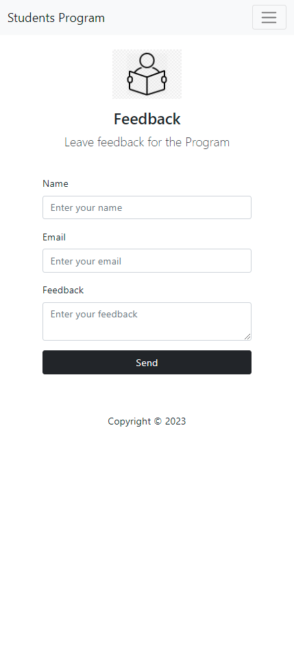
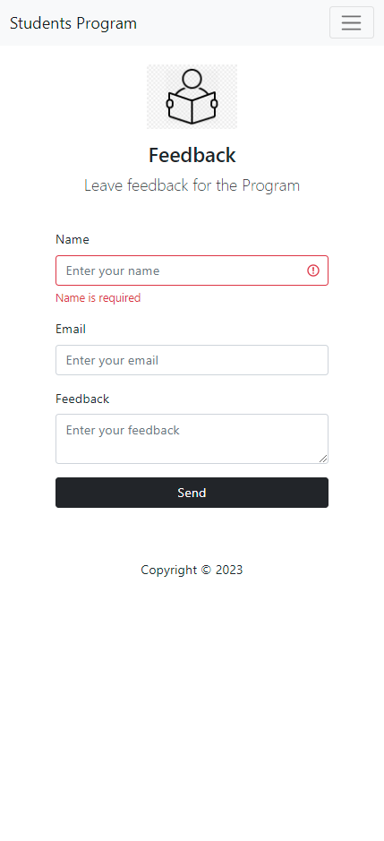
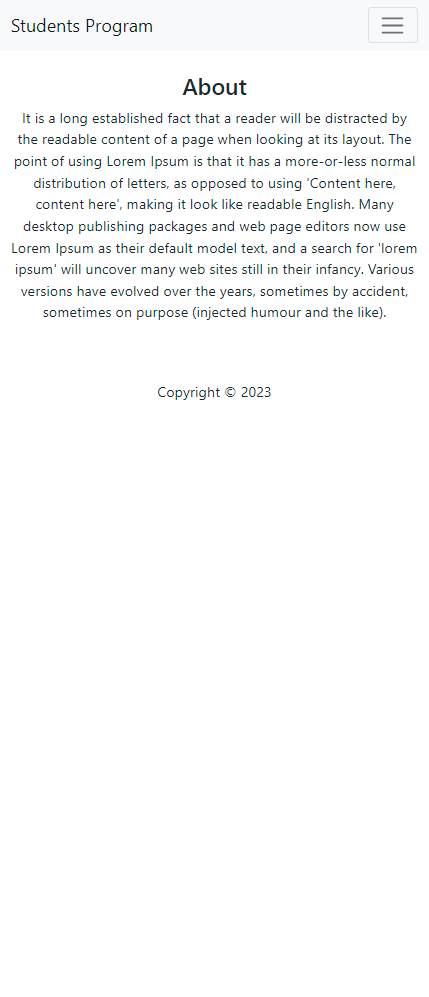
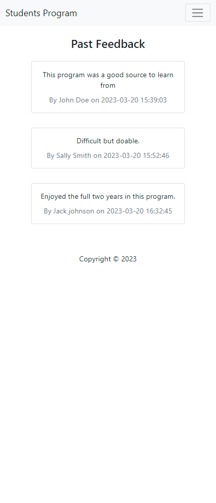

# FeedbackSys
A demo php web application for feedback and review submission using mysql db.

It consists of 3 pages:
- Feedback form
- About page
- Feedback list

## Screenshots

## Development Environment
This demo was developed using XAMPP, a free and open-source cross-platform web server solution by Apache Friends.
It was ran Apache HTTP Server and MySQL as backend.

